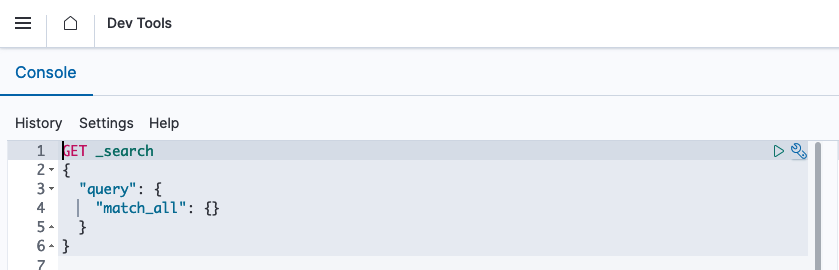

# Console Plugin

The `Console` Plugin can store and make requests to OpenSearch directly from the user.

One way you can access the `Console` plugin is to navigate to `Dev Tools`.



### Generating specs for autocompletion

The autocompletion in this section is based on files stored [here](https://github.com/opensearch-project/OpenSearch-Dashboards/tree/main/src/plugins/console/server/lib/spec_definitions). If the REST API for OpenSearch was updated then the spec can be regenerated and stored by doing the following:

1. First clone OpenSearch:
```
git clone https://github.com/opensearch-project/OpenSearch.git
```
2. From OpenSearch Dashboards root folder (assuming OpenSearch is in the same parent folder):
```
node scripts/spec_to_console.js -g "../OpenSearch/rest-api-spec/src/main/resources/rest-api-spec/api/*.json" -d "src/plugins/console/server/lib/spec_definitions/json/generated"
```

By using the wild card `*` this will generate any updates and place it the `generated` folder for the `Console` plugin.

But if you just want to run it for a specific spec then specify the spec. For example, if you want the spec for `cat.cluster_manager.json` do the following:
```
node scripts/spec_to_console.js -g "../OpenSearch/rest-api-spec/src/main/resources/rest-api-spec/api/cat.cluster_manager.json" -d "src/plugins/console/server/lib/spec_definitions/json/generated"
```

> ⚠ **WARNING**: Some of these files get generated with the legacy applications link for the `documentation` value. Do not merge that in, just revert it back to OpenSearch.

Once the updates are made and there are no problematic references, run OpenSearch Dashboards and navigate to `Dev Tools`. Verify that you are changes are working as expected.


