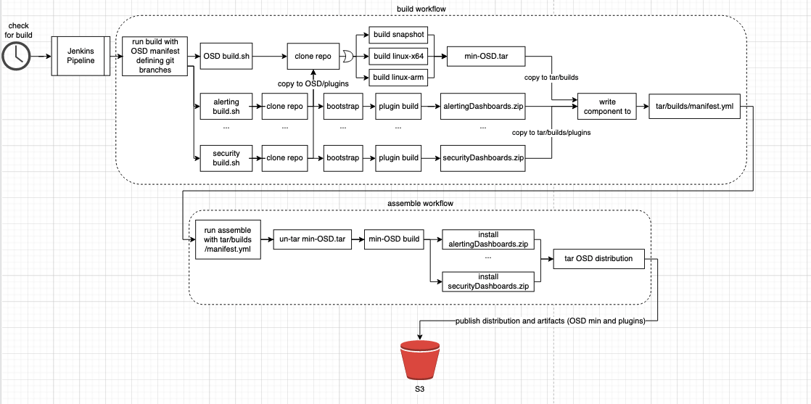

# Release Cycle

Here is the current state of what happens during a release cycle [last updated 6/16/22].

## Definitions
* Release build - a build with compiled down JavaScript code.
* Snapshot build - a build with TypeScript code.
* Core - OpenSearch or OpenSearch Dashboards.
* External plugins - plugins not stored in Core repos.
* Artifact - a build (release or snapshot) of Core repos or zips of plugins.
* Distribution - an artifact with external plugins installed (previously referenced as bundle).
* Min - an artifact without external plugins installed (previously referenced as vanilla).
* BWC tests - Backwards compatibility tests
* Sanity tests - defined as integ tests within the build system
* Input manifest - details of plugins to install, branch to use, version and qualifer to build, etc. [[EXAMPLE](https://github.com/opensearch-project/opensearch-build/blob/main/manifests/2.0.0/opensearch-dashboards-2.0.0.yml)]
* Build manifest - manifest produced by build job, includes details from the input manifest but more fine grained with commit hashes. [[EXAMPLE](https://ci.opensearch.org/ci/dbc/distribution-build-opensearch-dashboards/2.0.0/latest/linux/x64/tar/dist/opensearch-dashboards/manifest.yml)]
* Test manifest - manifest that defines what test to run (OpenSearch Dashboards supports BWC tests and sanity tests) [[EXAMPLE](https://github.com/opensearch-project/opensearch-build/blob/main/manifests/2.0.0/opensearch-dashboards-2.0.0-test.yml)].

The [OpenSearch Build Repo](https://github.com/opensearch-project/opensearch-build), does the work of building artifacts for releases and is maintained by the infra team (or sometimes Engineering Effectiveness team). This repo will call the scripts under [building releases](build.md), [building plugins](../plugins/build.md), and [installing plugins](../plugins/install.md).

## Overview

For the sake of simplicity, let's use version `2.0.0` and `TAR` but this content should apply to all major, minor, and patch release versions and types. When a build of OpenSearch Dashboards is triggered for `2.0.0` for `TAR` here is a diagram of what happens.

### Build and Assemble Distribution and Artifacts


Here you can see, the [check-for-build](https://github.com/opensearch-project/opensearch-build/blob/main/jenkins/check-for-build.jenkinsfile) job is a CRON job that triggers builds defined by the infra team.

This triggers the [build job](https://github.com/opensearch-project/opensearch-build/blob/main/jenkins/opensearch-dashboards/distribution-build.jenkinsfile) for OpenSearch Dashboards. Jenkins then scales a [docker image](https://github.com/opensearch-project/opensearch-build/blob/main/manifests/2.0.0/opensearch-dashboards-2.0.0.yml#L8). Then this job reads the input manifest for the components defined and clones them in the docker environment. Then it executes the build scripts of [OpenSearch Dashboards](https://github.com/opensearch-project/opensearch-build/blob/main/scripts/components/OpenSearch-Dashboards/build.sh) and then the build scripts of plugins, for example, [reportsDashboards](https://github.com/opensearch-project/opensearch-build/blob/main/scripts/components/reportsDashboards/build.sh). If an explicit build script for a plugin is not defined [here](https://github.com/opensearch-project/opensearch-build/tree/main/scripts/components) then it would use a [default build script](https://github.com/opensearch-project/opensearch-build/blob/main/scripts/default/opensearch-dashboards/build.sh) for the Core repo.

If the builds were successful then it will execute the assemble workflow which essentially calls this [script](../plugins/install.md#from-file) for each plugin.

Finally publishing everything to an S3 bucket and updating an index file that marks the links to the latest build. Which is accessible to the public, for example:

```
https://ci.opensearch.org/ci/dbc/distribution-build-opensearch-dashboards/2.0.0/latest/linux/x64/tar/dist/opensearch-dashboards/opensearch-dashboards-2.0.0-linux-x64.tar.gz
```

### Sanity Tests

`TODO insert diagram`

After the [build and assemble job](#build-and-assemble-distribution-and-artifacts) is completed. It will trigger an [integ test job](https://github.com/opensearch-project/opensearch-build/blob/main/jenkins/opensearch-dashboards/integ-test.jenkinsfile) with the build manifest and test manifest it produced. Jenkins then scales a [docker image](https://github.com/opensearch-project/opensearch-build/blob/main/manifests/2.0.0/opensearch-dashboards-2.0.0-test.yml#L6). Then this job reads the test manifest for the components to run sanity tests for. As you can see [here](https://github.com/opensearch-project/opensearch-build/blob/main/manifests/2.0.0/opensearch-dashboards-2.0.0-test.yml#L14), only `functionalTestDashboards` has sanity tests defined to be executed. This component is the [Functional Test Repo (FTRepo)](https://github.com/opensearch-project/opensearch-dashboards-functional-test). This repo will read the build manifest for the components and run the tests for all the components defined in the manifest. Then it will download the latest build from OpenSearch for `2.0.0` and scale up the cluster, then run the distribution defined in the build manifest but downloading it and running it. 

The job will then clone the FTRepo and look and run [integtest.sh](https://github.com/opensearch-project/opensearch-dashboards-functional-test/blob/main/integtest.sh) with the proper flags. This will start up Cypress and run the tests.

Publishing the results to S3, where you can explore the test results [here](https://opensearch-project.github.io/opensearch-dashboards-functional-test/site/).

### BWC Tests

`TODO`


